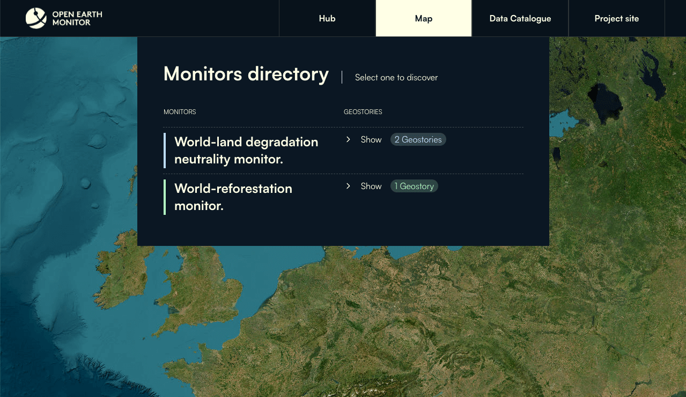

# Open-Earth-Monitor Cyber-infrastructure



## Overview

 _description_

 ## Table of Contents

1. [Installation & development](#installation--development)
2. [Deployment](#deployment)
3. [Contributing](#contributing)

## Installation & development

Requirements:

* NodeJs v18
* Yarn

### Main libraries used in the project

- [React](https://reactjs.org/) as a UI library
- [Next.js](https://nextjs.org/) as a React framework
- [Tailwind CSS](https://tailwindcss.com/) as a styles framework
- [Typescript](https://www.typescriptlang.org/) as a programming language
- [OpenLayers](https://openlayers.org/) as a map library
- [Playwright](https://playwright.dev/) as e2e testing framework
- [Radix UI](https://www.radix-ui.com/) as a UI components library
- [VisX](https://airbnb.io/visx/) as a data visualization library

## Quick start for development

In order to start modifying the app, please make sure to correctly configure your workstation:

1. Make sure you have [Node.js](https://nodejs.org/en/) installed or install [NVM](https://github.com/nvm-sh/nvm) to manage your different Node.js versions
2. (Optional) Use [Visual Studio Code](https://code.visualstudio.com/) as a text editor to benefit from automatic type checking
3. (Optional) Configure your text editor with the [Prettier](https://prettier.io/), [ESLint](https://eslint.org/), [EditorConfig](https://editorconfig.org/), [Tailwind CSS](https://tailwindcss.com/docs/plugins) recommended plugins
4. Use the correct Node.js version for this app by running `nvm use`; if you didn't install NVM (step 2), then manually install the Node.js version described in `.nvmrc`.
5. Install [Yarn](https://yarnpkg.com/) by running `npm install -g yarn`.

Create environment file following the `.env.example` file, creating a file called `.env.local`. For more info about environment variables, check the [Environment variables](#environment-variables) section.

Example:
```bash
NEXT_PUBLIC_API_URL=http://api-domain.org
```

Install the dependencies:

```bash
yarn install
```

Run the server for development:

```bash
yarn dev
```

You can access a hot-reloaded version of the app on [http://localhost:3000](http://localhost:3000).

### Production

To build the app for production, run:

```bash
yarn build
```

This will create an optimized production build in the `.next` folder.

Run de application in production mode:

```bash
yarn start
```

Check out the [Next.js deployment documentation](https://nextjs.org/docs/deployment) for more details.

## Environment variables

Set the environment variables needed creating a file `.env.local` in the root of the project with the following content:

| Variable name | Description |  Default value |
|-|-|-|
| NEXT_PUBLIC_API_URL | URL of the API for datasets Data. | http://localhost:3000 | 

## Contributing

Please, **create a PR** for any improvement or feature you want to add. Try not to commit anything directly on the `main` branch.
